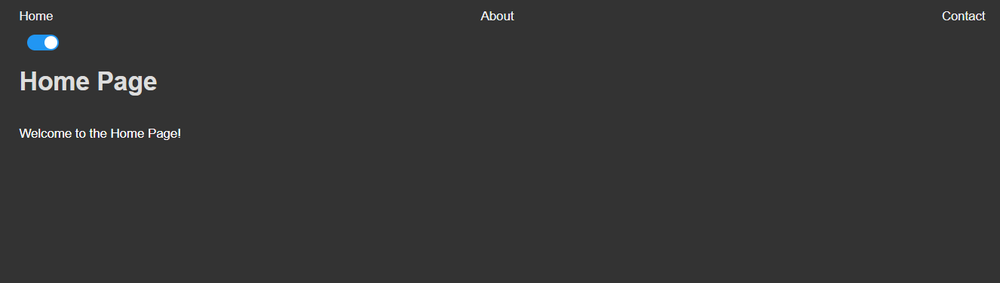
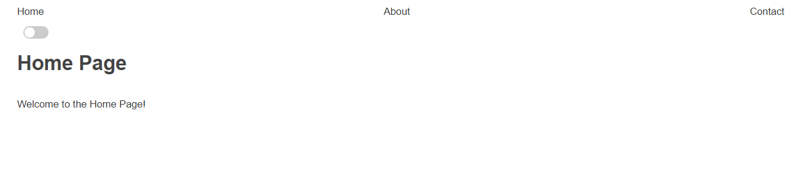

# Theme Toggle in React: Light and Dark Mode

This project demonstrates how to implement a **light and dark mode toggle** in a React application. It uses the **React Context API** for state management and CSS variables for theme-specific styling.

---

## **Features**

- Toggle between light and dark modes.
- Smooth theme transitions with CSS variables.
- Theme preference persistence using `localStorage`.
- Easily extendable for additional styles and components.

---

## **Preview**

Dark Mode


Light Mode


---

## **Getting Started**

### **Prerequisites**

Ensure you have the following installed on your system:

- [Node.js](https://nodejs.org/) (v14 or later)
- [npm](https://www.npmjs.com/) or [yarn](https://yarnpkg.com/)

---

### **Installation**

1. Clone the repository:

   ```bash
   git clone https://github.com/Prayag-09/React-Templates-Resources-and-Components.git
   cd '.\Dark and Light Mode\'
   ```

2. Install dependencies:

   ```bash
   npm install
   ```

3. Start the development server:
   ```bash
   npm run dev
   ```

---

## **Project Structure**

```
Dark and Light Mode/
├── src/
│   ├── components/
│   │   ├── navbar.jsx
│   ├── hooks/
│   │   ├── useTheme.jsx
│   ├── App.js
│   ├── App.css
│   ├── index.js
│   ├── index.css
├── package.json
├── README.md
```

---

## **Contributing**

Feel free to fork this project, submit issues, or contribute via pull requests. All contributions are welcome!

---

## **License**

This project is licensed under the [MIT License](LICENSE).

---

## **Acknowledgements**

- [React Documentation](https://reactjs.org/docs/getting-started.html)
- [CSS Variables](https://developer.mozilla.org/en-US/docs/Web/CSS/Using_CSS_custom_properties)

---

Let me know if you'd like to customize this further or need help setting up a GitHub repository! 🚀
